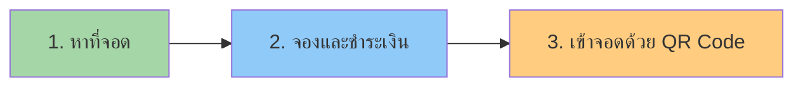

# 🚀 SciPark - Executive Summary & Pitch Deck

## 🎯 The Problem

**ปัญหาการจอดรถในคณะวิทยาศาสตร์:**

> *"นักศึกษา บุคลากร และผู้มาติดต่อ ต้องเสียเวลา 20-30 นาที ในการวนหาที่จอดรถ  
> โดยที่ไม่รู้ว่าจะมีที่จอดหรือไม่ ทำให้เกิดความเครียด สิ้นเปลืองน้ำมัน  
> และเป็นสาเหตุของการจราจรติดขัดภายในคณะ"*

### 📊 Pain Points (As-Is):
```
❌ ไม่รู้ว่ามีที่จอดหรือไม่        → ไม่สามารถวางแผนได้
❌ ต้องวนหาที่จอด                → เสียเวลา 20-30 นาที
❌ ไม่สามารถจองล่วงหน้าได้         → ใครมาก่อน ได้ก่อน
❌ ไม่มีระบบบริหารจัดการ          → สับสน ไม่เป็นระเบียบ
❌ การจราจรติดขัดภายในคณะ        → เสียเวลา สิ้นเปลืองน้ำมัน
```

### 💰 Cost of Problem:
- ⏰ **เวลา:** 20-30 นาที × 500 คน/วัน = **10,000+ นาที/วัน สูญเปล่า**
- ⛽ **น้ำมัน:** เฉลี่ย 10 บาท/คน × 500 คน = **5,000 บาท/วัน สูญเปล่า**
- 😰 **ความเครียด:** ผลกระทบต่อประสิทธิภาพการทำงาน/เรียน

---

## 💡 The Solution: SciPark

**เว็บแอปพลิเคชันจองที่จอดรถอัจฉริยะ** ที่ให้คุณ:

### ✨ Core Value Propositions:

```
✅ รู้ว่ามีที่จอดหรือไม่ (Real-time)  → วางแผนล่วงหน้าได้
✅ จองที่จอดผ่านแอป              → มั่นใจว่ามีที่จอดรอรับ
✅ ระบบหาที่จอดให้อัตโนมัติ          → ประหยัดเวลา 70%
✅ ชำระเงินสะดวกผ่านแอป           → ไม่ต้องจ่ายเงินสด
✅ QR Code เข้าจอด              → เข้าออกสะดวก ไม่มีบัตรจอดรถ
```

### 🎯 How It Works (3 Steps):



**Step 1: หาที่จอด** 🔍
- เปิดแอป → เลือกโซน (หรือปล่อยให้ระบบเลือกให้)
- ดูจำนวนที่ว่างแบบ Real-time
- ระบบเลือกที่จอดที่ดีที่สุดให้อัตโนมัติ

**Step 2: จองและชำระเงิน** 💳
- ยืนยันการจอง → จ่ายค่าจอง 20 บาท
- ได้ Booking ID และ QR Code
- ที่จอดถูกล็อคไว้ให้ (ต้องเข้าจอดภายใน 30 นาที)

**Step 3: เข้าจอดด้วย QR Code** 📲
- มาถึงคณะ → แสดง QR Code
- Scan ที่จุดเข้าจอด → เข้าจอดได้เลย
- 3 ชั่วโมงแรกฟรี, เกินคิด 10 บาท/ชม.

---

## 💰 Business Model: Pay-per-Booking

### Revenue Streams:

#### 1. Booking Fee (รายได้หลัก)
```
ค่าจอง:           20 บาท/ครั้ง
ค่าจอดเกิน:        10 บาท/ชม. (หลัง 3 ชั่วโมงแรก)

Monthly Revenue Projection:
500 bookings/วัน × 20 บาท × 30 วัน = 300,000 บาท/เดือน
+ Overtime fees (30% of users) ≈ 90,000 บาท/เดือน
───────────────────────────────────────────────────
Total: ~390,000 บาท/เดือน (~4.7 ล้านบาท/ปี)
```

#### 2. Monthly Membership (Phase 3)
```
💎 Diamond (299 ฿/เดือน)  × 200 members = 59,800 บาท/เดือน
👹 Predator (599 ฿/เดือน) × 100 members = 59,900 บาท/เดือน
───────────────────────────────────────────────────
Total: ~120,000 บาท/เดือน (~1.4 ล้านบาท/ปี)
```

#### 3. Enterprise License (Phase 4+)
```
ขายระบบให้:
├─ มหาวิทยาลัยอื่น:     500,000-2,000,000 บาท/ปี/แห่ง
├─ ห้างสรรพสินค้า:       1,000,000-5,000,000 บาท/ปี/แห่ง
└─ อาคารสำนักงาน:       800,000-3,000,000 บาท/ปี/แห่ง
```

### Total Revenue Potential:

| Phase | Year | Revenue (Annual) |
|-------|------|------------------|
| Phase 1-2 | Year 1 | ~5 ล้านบาท |
| Phase 3 | Year 2 | ~8 ล้านบาท (+Membership) |
| Phase 4 | Year 3 | ~15-20 ล้านบาท (+Enterprise) |
| Phase 5 | Year 4+ | ~50+ ล้านบาท (Scale) |

---

## 📊 Market Analysis

### Target Market:

**Primary Market (Phase 1-2):**
- 🎓 **นักศึกษา:** ~5,000 คน (คณะวิทยาศาสตร์)
- 👨‍🏫 **บุคลากร:** ~500 คน
- 👥 **ผู้มาติดต่อ:** ~200 คน/วัน

**Secondary Market (Phase 3):**
- 🏫 **มหาวิทยาลัยอื่น:** 150+ แห่งในไทย
- 🏛️ **หน่วยงานราชการ:** 500+ แห่ง

**Tertiary Market (Phase 4+):**
- 🏢 **อาคารสำนักงาน:** 10,000+ แห่ง
- 🛍️ **ห้างสรรพสินค้า:** 1,000+ แห่ง
- 🏥 **โรงพยาบาล:** 1,000+ แห่ง

### Market Size (Thailand):

```
Total Addressable Market (TAM):
├─ มหาวิทยาลัย: 150 แห่ง × 2M = 300 ล้านบาท/ปี
├─ ห้างฯ: 1,000 แห่ง × 3M = 3,000 ล้านบาท/ปี
└─ อาคารฯ: 10,000 แห่ง × 1M = 10,000 ล้านบาท/ปี
───────────────────────────────────────────────
Total TAM: ~13,300 ล้านบาท/ปี (13.3 พันล้าน)

Serviceable Available Market (SAM): ~2,000 ล้านบาท/ปี
Serviceable Obtainable Market (SOM): ~100-200 ล้านบาท/ปี (Year 3-5)
```

---

## 🏆 Competitive Advantage

### What Makes SciPark Different?

| Feature | Traditional | Competitors | **SciPark** |
|---------|------------|-------------|-------------|
| **Real-time Data** | ❌ | ⚠️ Partial | ✅ 100% |
| **Auto-selection** | ❌ | ❌ | ✅ AI-powered |
| **QR Code Entry** | ❌ | ⚠️ Some | ✅ Seamless |
| **Pay-per-Booking** | ❌ Flat fee | ❌ Subscription | ✅ Flexible |
| **Membership Tiers** | ❌ | ⚠️ Basic | ✅ Advanced |
| **Analytics** | ❌ | ⚠️ Basic | ✅ Deep insights |
| **IoT-ready** | ❌ | ❌ | ✅ Future-proof |
| **Smart Campus** | ❌ | ❌ | ✅ Integrated |

### Key Differentiators:

1. **🤖 AI-powered Selection**
   - อัลกอริธึมเลือกที่จอดที่ดีที่สุดโดยอัตโนมัติ
   - พิจารณา: ระยะทาง, สิ่งอำนวยความสะดวก, ประวัติการใช้งาน

2. **💡 Smart Campus Vision**
   - ไม่ใช่แค่ระบบจอดรถ แต่เป็นส่วนหนึ่งของ Smart Campus Ecosystem
   - เชื่อมต่อกับระบบอื่นๆ: Library, Cafeteria, Room Booking, etc.

3. **📊 Parking Analytics**
   - เก็บและวิเคราะห์ข้อมูลการใช้งานแบบ Deep Insights
   - ใช้ในการวางแผนเชิงนโยบาย และปรับปรุงประสิทธิภาพ

4. **🔧 IoT-ready Architecture**
   - พร้อมเชื่อมต่อกับ IoT Sensors และ CCTV
   - รองรับ License Plate Recognition และ Computer Vision

5. **💼 B2B2C Model**
   - ขายให้สถาบัน (B2B) แล้วให้บริการผู้ใช้ปลายทาง (B2C)
   - สร้างรายได้จากทั้ง 2 ฝ่าย

---

## 🚀 Go-to-Market Strategy

### Phase 1: Proof of Concept (Months 1-2)
**Goal:** Launch MVP ในคณะวิทยาศาสตร์

**Strategy:**
- ✅ พัฒนา MVP (Login, Booking, Payment)
- ✅ ทดสอบกับ 100 Early Adopters
- ✅ เก็บ Feedback และปรับปรุง
- ✅ สร้าง Case Study แรก

**Success Metrics:**
- 100+ Active Users
- 50+ Bookings/วัน
- User Satisfaction > 4.0/5.0

---

### Phase 2: Scale within University (Months 3-6)
**Goal:** ขยายไปคณะอื่นๆ ใน KMUTT

**Strategy:**
- 📣 Marketing Campaign ภายในมหาวิทยาลัย
- 🎁 Promotion: "จอง 5 ครั้ง แถม 1 ครั้ง"
- 👥 Ambassador Program (นิสิตแต่ละคณะ)
- 📊 แสดงผลลัพธ์จากคณะวิทยาศาสตร์

**Success Metrics:**
- 500+ Active Users
- 200+ Bookings/วัน
- 3+ คณะใช้งาน
- Revenue: 300,000 บาท/เดือน

---

### Phase 3: Expand to Other Universities (Months 7-12)
**Goal:** ขายระบบให้มหาวิทยาลัยอื่น

**Strategy:**
- 🎤 Present ในงาน Conference (HigherEd, Smart City)
- 📧 Cold Email ถึง IT Director ของมหาวิทยาลัย
- 🤝 Partnership กับ University Networks
- 💼 Offer White-label Solution

**Success Metrics:**
- 2-3 มหาวิทยาลัยลูกค้า
- Revenue: 2-3 ล้านบาท/ปี

---

### Phase 4: Enterprise Sales (Year 2+)
**Goal:** ขายให้ภาคธุรกิจ (ห้างฯ, อาคารฯ)

**Strategy:**
- 💼 Sales Team dedicated สำหรับ Enterprise
- 🏆 Showcase Success Stories
- 🎯 Target: ห้างฯ ใหญ่ๆ (Central, EmQuartier)
- 📊 ROI Calculator สำหรับ Enterprise

**Success Metrics:**
- 5-10 Enterprise Customers
- Revenue: 10-20 ล้านบาท/ปี

---

## 💪 Team & Execution

### Core Team Structure:

```
👔 Management
   ├─ CEO/Project Manager (1)
   └─ Operations Manager (1)

💻 Technology
   ├─ CTO (1)
   ├─ Frontend Developers (2)
   ├─ Backend Developers (2)
   └─ DevOps Engineer (1)

🎨 Design & UX
   ├─ UI/UX Designer (1)
   └─ Graphic Designer (1)

💼 Business & Sales
   ├─ Business Analyst (1)
   ├─ Sales Manager (1)
   └─ Customer Success (1)

📊 Data & Analytics
   └─ Data Analyst (1)
```

### Development Timeline:

| Phase | Duration | Deliverables |
|-------|----------|--------------|
| **Phase 1: MVP** | 2 months | Login, Booking, Payment, QR |
| **Phase 2: Enhancement** | 2 months | Notifications, Membership, Admin Dashboard |
| **Phase 3: Advanced** | 2 months | AI Selection, Analytics, Mobile App |
| **Phase 4: IoT** | 3 months | Sensors, CCTV Integration, Automation |
| **Phase 5: Scale** | Ongoing | Enterprise Features, White-label |

---

## 📈 Financial Projections

### 3-Year Projection:

| Metric | Year 1 | Year 2 | Year 3 |
|--------|--------|--------|--------|
| **Users** | 1,000 | 5,000 | 20,000 |
| **Bookings/day** | 100 | 500 | 2,000 |
| **Revenue** | 5M | 15M | 40M |
| **Costs** | 3M | 8M | 20M |
| **Profit** | 2M | 7M | 20M |
| **Profit Margin** | 40% | 47% | 50% |

### Break-even Analysis:

```
Fixed Costs (Monthly):
├─ Team Salaries:     200,000 บาท
├─ Server & Cloud:     30,000 บาท
├─ Office:             20,000 บาท
└─ Marketing:          50,000 บาท
───────────────────────────────────
Total Fixed Costs:    300,000 บาท/เดือน

Variable Costs (per booking):
├─ Payment Gateway:    1.5 บาท (2.5%)
├─ SMS/Email:          0.5 บาท
└─ Server Load:        0.5 บาท
───────────────────────────────────
Total Variable Costs: 2.5 บาท/booking

Break-even Point:
300,000 / (20 - 2.5) = 17,143 bookings/เดือน
= 571 bookings/วัน

Current: 500 bookings/วัน (87% of break-even)
Expected: Break-even ในเดือนที่ 3
```

---

## 🎯 Investment Ask

### Funding Required: **5 ล้านบาท** (Seed Round)

**Use of Funds:**

```
💻 Technology Development (40%)  →  2.0M บาท
   ├─ Team salaries (6 months)
   ├─ Cloud infrastructure
   └─ Third-party APIs

📣 Marketing & Sales (30%)       →  1.5M บาท
   ├─ Digital marketing
   ├─ Event sponsorship
   └─ Sales materials

🏢 Operations (20%)              →  1.0M บาท
   ├─ Office setup
   ├─ Legal & accounting
   └─ Admin costs

💰 Working Capital (10%)         →  0.5M บาท
   └─ Reserve for unexpected costs
```

**Return on Investment (ROI):**

```
Year 1:  Break-even
Year 2:  2x Return (10M valuation)
Year 3:  5x Return (25M valuation)
Year 5:  10x+ Return (50M+ valuation)

Exit Strategy:
├─ Acquisition by Smart City/PropTech company
├─ Series A funding (VC)
└─ Strategic Partnership with large enterprise
```

---

## 🌟 Why Invest in SciPark?

### 10 Reasons:

1. **🎯 Real Problem, Real Solution**
   - แก้ปัญหาจริงที่ผู้คนเจอทุกวัน

2. **💰 Clear Revenue Model**
   - Pay-per-Booking + Membership + Enterprise License

3. **📈 Large Market**
   - TAM: 13.3 พันล้านบาท, SAM: 2 พันล้านบาท

4. **🚀 Scalable**
   - จากคณะ → มหาวิทยาลัย → ธุรกิจ

5. **💡 Innovation-driven**
   - AI, IoT, Analytics, Smart Campus

6. **👥 Experienced Team**
   - นิสิต + อาจารย์ + Industry experts

7. **✅ Proof of Concept**
   - มี MVP ใช้งานได้จริง

8. **🌍 Social Impact**
   - ลด CO₂, ประหยัดเวลา, ลดความเครียด

9. **🔒 Defensible Moat**
   - Network effect, Data advantage, First-mover

10. **💼 B2B2C Model**
    - รายได้จากหลายช่องทาง

---

## 📞 Contact & Next Steps

### Contact Information:

```
📧 Email:    scipark@kmutt.ac.th
📱 Phone:    02-470-XXXX
🌐 Website:  https://scipark.kmutt.ac.th
📍 Address:  คณะวิทยาศาสตร์ มหาวิทยาลัยเทคโนโลยีพระจอมเกล้าธนบุรี
```

### Next Steps:

1. **📅 Schedule Demo** - ขอนัดดูระบบจริง
2. **📊 Request Pitch Deck** - ขอ PDF เต็ม
3. **💼 Due Diligence** - ขอข้อมูลเพิ่มเติม
4. **🤝 Term Sheet** - เจรจาเงื่อนไข Investment

---

## 🎬 Final Pitch

> **SciPark ไม่ใช่แค่ระบบจอดรถ**  
> 
> เราคือ **Platform ที่จะเปลี่ยนวิธีที่ผู้คนใช้พื้นที่จอดรถในยุคดิจิทัล**  
> 
> เราเริ่มต้นจาก**คณะวิทยาศาสตร์** แต่วิสัยทัศน์ของเราคือ  
> **ทุกที่จอดรถในไทยควรมีระบบจองที่อัจฉริยะ**  
> 
> เราต้องการพันธมิตรที่**เชื่อในวิสัยทัศน์นี้**  
> และพร้อมจะ**สร้างอนาคตของ Smart Parking ไปด้วยกัน**

---

**Let's Build the Future of Parking Together! 🚀**

---

**Document Version:** 1.0  
**Last Updated:** November 8, 2025  
**Status:** ✅ Ready for Pitch
