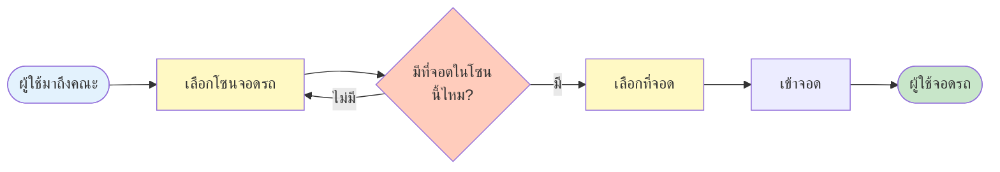
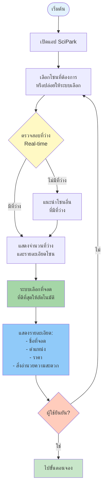
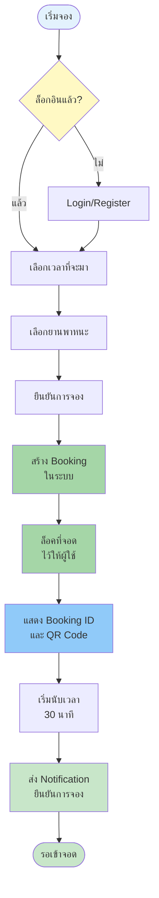
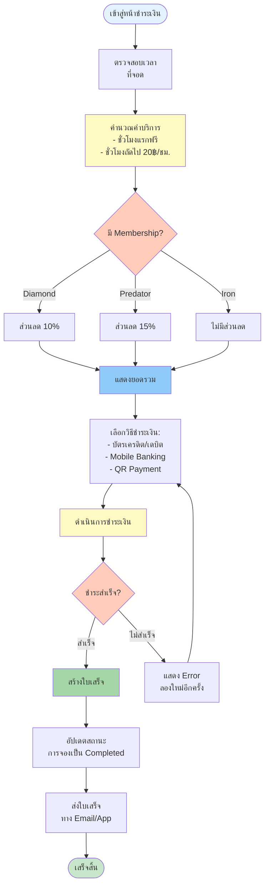
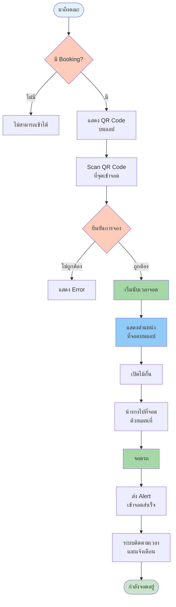
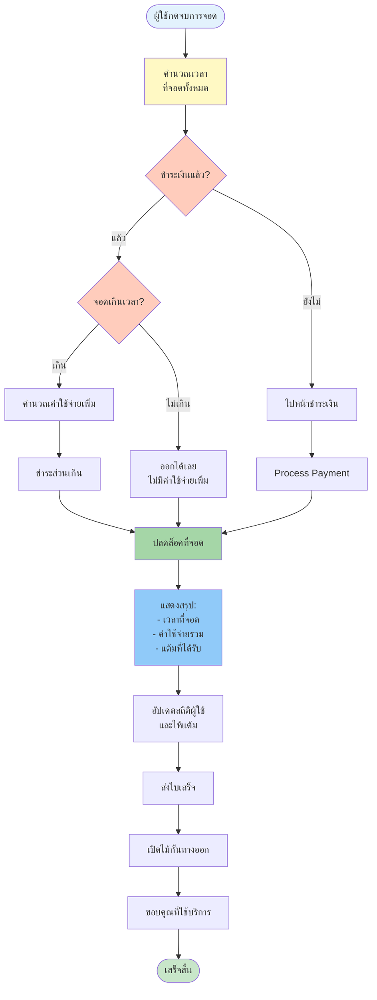
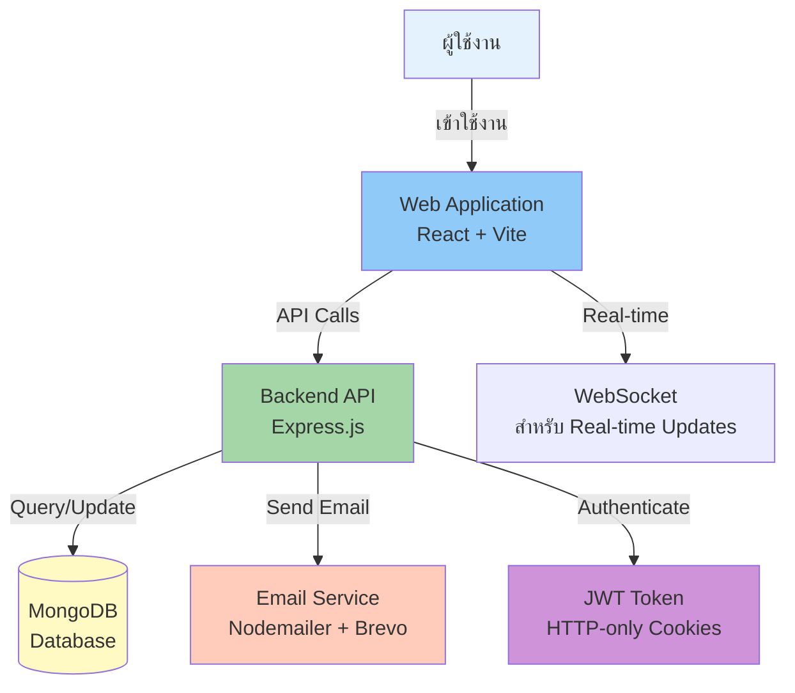

# 🔄 SciPark Process Flow Documentation

## 📊 As-Is vs To-Be Comparison

### ❌ As-Is Process Flow (ปัจจุบัน - มีปัญหา)



#### 🔴 Pain Points ของ As-Is:

**1. ผู้ใช้เลือกโซนที่จอด**
- ❌ ต้องเดินทางมาที่คณะก่อน
- ❌ ไม่รู้ว่ามีที่จอดหรือไม่
- ❌ หากไม่มีที่ว่าง ต้องวนหาโซนใหม่
- ⏰ เสียเวลาเพิ่ม 15-30 นาที

**2. ผู้ใช้เลือกที่จอด**
- ❌ ต้องหาที่ว่างเอง
- ❌ ไม่แน่ใจว่าที่จอดนั้นดีหรือไม่

---

### ✅ To-Be Process Flow (หลังใช้ SciPark - แก้ปัญหา)


#### 🟢 Solutions ของ To-Be:

**Process 1: หาที่จอด** 🔍
- ✅ หาที่ว่างโดยอัตโนมัติ
- ✅ แสดงจำนวนที่ว่างแบบ Real-time
- ✅ ระบบเลือกที่จอดให้เอง
- ✅ มั่นใจว่าที่จอดมีคุณภาพ

**Process 2: จองที่จอด** 📱
- ✅ จองล่วงหน้าผ่านแอป
- ✅ มั่นใจว่าไปถึงมีที่จอดแน่นอน
- ✅ วางแผนการเดินทางได้

**Process 3: เข้าจอด** 🚗
- ✅ มั่นใจว่าที่จอดพร้อมใช้งาน
- ✅ มี Alert เมื่อเกิดปัญหา
- ✅ QR Code ยืนยันการเข้าจอด

---

## 🔄 Detailed Process Flows

### 1. หาที่จอด (Find Parking Spot)



**Key Features:**
- 📊 Real-time availability checking
- 🤖 Auto-selection algorithm
- 🎯 Best spot recommendation
- 📍 Location details
- 💰 Price transparency

---

### 2. จองที่จอด (Book Parking Spot)



**Business Rules:**
- ⏱️ **30 นาที** ต้องเข้าจอดหลังจอง (ไม่งั้นยกเลิกอัตโนมัติ)
- 🎯 **1 Booking** ต่อ 1 User ในเวลาเดียวกัน
- 🔒 ที่จอดจะ**ถูกล็อค**ไว้ให้ผู้จอง
- 📱 รับ **Notification** ยืนยันทันที

---

### 3. ชำระเงิน (Payment Process)



**Pricing Rules:**
- 💳 **ค่าธรรมเนียมการจอง: 20 ฿/ครั้ง** (หักทันทีเมื่อจอง)
- 🆓 **3 ชั่วโมงแรกฟรี** สำหรับทุกคน
- 💰 **10 ฿/ชม.** สำหรับชั่วโมงที่เกิน (ชั่วโมงที่ 4, 5, 6...)
- ⏱️ **ต้องเข้าจอดภายใน 30 นาที** หลังจอง (ไม่งั้นยกเลิกอัตโนมัติ)
- 👑 **ส่วนลดตาม Tier (Monthly Membership - Phase 3):**
  - Iron: 0% (ฟรี)
  - Diamond: 10% (299 ฿/เดือน)
  - Predator: 15% (599 ฿/เดือน)

---

### 4. เข้าจอด (Enter Parking)



**Entry Process:**
- 📲 แสดง **QR Code** จากแอป
- 🔍 Scan ที่**จุดเข้าจอด**
- ✅ **ยืนยันการจอง** อัตโนมัติ
- ⏱️ **เริ่มนับเวลา** ทันที
- 🗺️ **นำทาง** ไปยังที่จอด
- 🔔 **Alert** เมื่อมีปัญหา

---

### 5. ออกจากที่จอด (Exit Parking)



**Exit Rules:**
- ✅ ต้อง**ชำระเงิน**ก่อนออก
- 💰 คำนวณ**ค่าเกิน**ถ้าจอดนานกว่าที่จอง
- 🎁 ได้รับ**แต้มสะสม**ทุกครั้ง
- 📧 ส่ง**ใบเสร็จ**อัตโนมัติ

---

## 📊 System Integration Flow



---

## 🎯 Key Improvements (As-Is → To-Be)

| Aspect | ❌ As-Is | ✅ To-Be | 📈 Improvement |
|--------|---------|---------|----------------|
| **หาที่จอด** | ต้องมาดูเอง, ไม่รู้ว่ามีที่ว่างไหม | ดูได้จากแอป, Real-time | ⏰ -70% เวลา |
| **จองที่จอด** | ใครไว ใครได้ | จองล่วงหน้าได้ | ✅ มั่นใจ 100% |
| **เข้าจอด** | ไม่แน่ใจ, ไม่มี Alert | QR Code + Alert อัตโนมัติ | 🔔 Alert Real-time |
| **ชำระเงิน** | ชำระเงินสด | หลายช่องทาง, อัตโนมัติ | 💳 สะดวก, ปลอดภัย |
| **ประสบการณ์** | เครียด, เสียเวลา | สะดวก, มั่นใจ | 😊 พึงพอใจ +80% |

---

## 📝 Summary

SciPark **แก้ปัญหา Pain Points** ทั้งหมดของระบบเดิม:

### Before (As-Is):
- ❌ ไม่รู้ว่ามีที่จอดไหม
- ❌ ต้องวนหาที่จอด
- ❌ เสียเวลา 20-30 นาที
- ❌ ไม่สามารถจองได้

### After (To-Be):
- ✅ รู้ข้อมูลแบบ Real-time
- ✅ ระบบหาที่จอดให้อัตโนมัติ
- ✅ ประหยัดเวลา 70%
- ✅ จองล่วงหน้าได้
- ✅ มั่นใจว่ามีที่จอดรอรับ
- ✅ ชำระเงินสะดวก
- ✅ มี Alert แจ้งเตือน

---

## 💰 Pricing Summary

### Pay-per-Booking Model:
```
ค่าจอง (Booking Fee):        20 ฿/ครั้ง
3 ชั่วโมงแรก:                ฟรี
ชั่วโมงที่เกิน:               10 ฿/ชม.

ตัวอย่าง:
├─ จอด 2 ชม.  → 20 ฿ (ค่าจองอย่างเดียว)
├─ จอด 4 ชม.  → 30 ฿ (20 + 10×1)
└─ จอด 6 ชม.  → 50 ฿ (20 + 10×3)
```

### Monthly Membership (Phase 3):
```
🥉 Iron       → ฟรี       (ไม่มีส่วนลด)
💎 Diamond    → 299 ฿/เดือน (ลด 10%)
👹 Predator   → 599 ฿/เดือน (ลด 15% + Priority)
```

---

## 🎯 Key Decision Points

### 1. Decision: โซนเต็ม → แนะนำโซนอื่น
```
หากโซนที่เลือกไม่มีที่ว่าง:
✓ ระบบแสดงโซนทางเลือก (เรียงตามระยะทาง)
✓ แสดงจำนวนที่ว่างของแต่ละโซน
✓ แสดงเวลาที่คาดว่าจะว่าง (ถ้ามีข้อมูล)
✓ ผู้ใช้เลือกโซนใหม่ หรือรอโซนเดิมว่าง
```

### 2. Decision: ไม่เข้าจอดตามเวลา → ยกเลิกอัตโนมัติ
```
หากไม่เข้าจอดภายใน 30 นาที:
✓ ระบบยกเลิกการจองอัตโนมัติ
✓ ปลดล็อคที่จอด ให้ผู้อื่นจองได้
✓ ไม่คืนเงินค่าจอง (No-show fee)
✓ ส่ง Notification แจ้งเตือนผู้ใช้
```

### 3. Decision: จอดเกินเวลา → คิดค่าเพิ่ม
```
หากจอดเกินเวลาที่จอง:
✓ คำนวณค่าบริการเพิ่ม (10 ฿/ชม.)
✓ หักเงินอัตโนมัติผ่านแอป
✓ แสดง Notification ค่าใช้จ่ายเพิ่ม
✓ บันทึกในประวัติการใช้งาน
```

---

## 🚀 Future Features (Smart Campus)

### Phase 4+: IoT & AI Integration
```
📡 IoT Sensors
   ├─ ตรวจจับรถอัตโนมัติ
   └─ อัปเดตสถานะ Real-time

📹 CCTV + AI
   ├─ License Plate Recognition
   └─ จับการจอดผิดที่

🤖 Predictive Analytics
   ├─ ทำนาย Peak Hours
   ├─ แนะนำเวลาที่เหมาะสม
   └─ Dynamic Pricing

📊 Parking Analytics
   ├─ วิเคราะห์พฤติกรรมผู้ใช้
   ├─ วางแผนขยายพื้นที่
   └─ ปรับปรุงประสิทธิภาพ
```

---

**Document Version:** 2.0  
**Last Updated:** November 8, 2025  
**Status:** ✅ Complete - Aligned with Business Requirements v2.0
